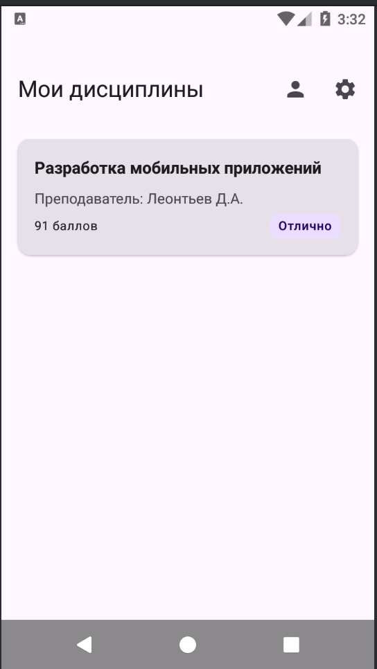
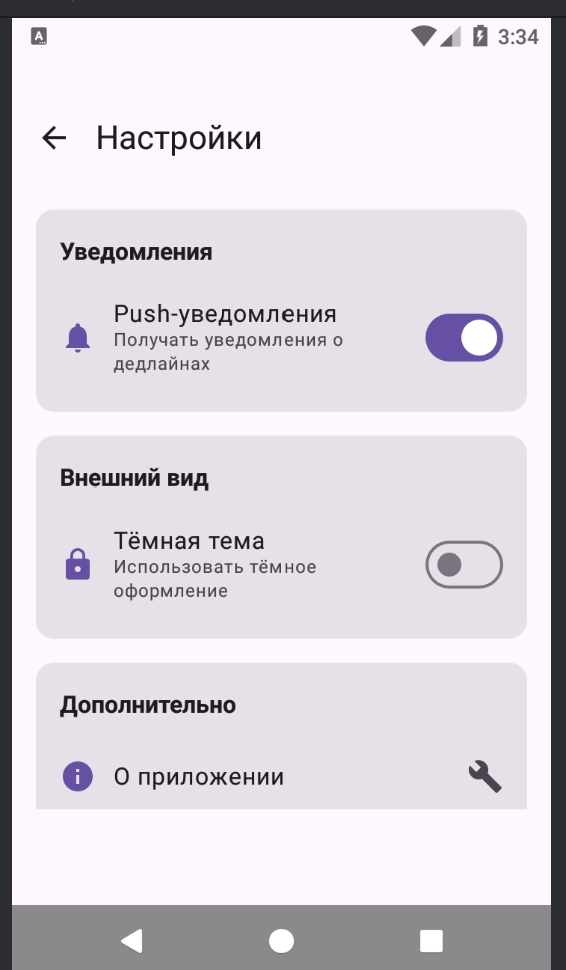
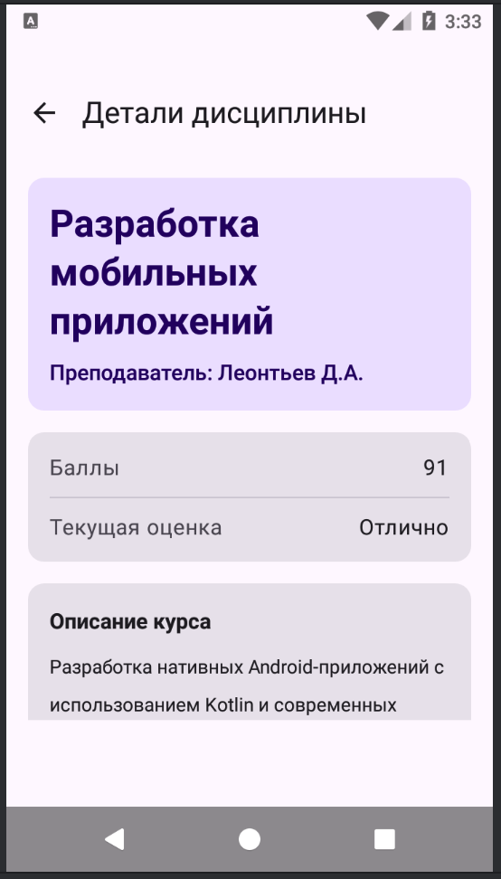
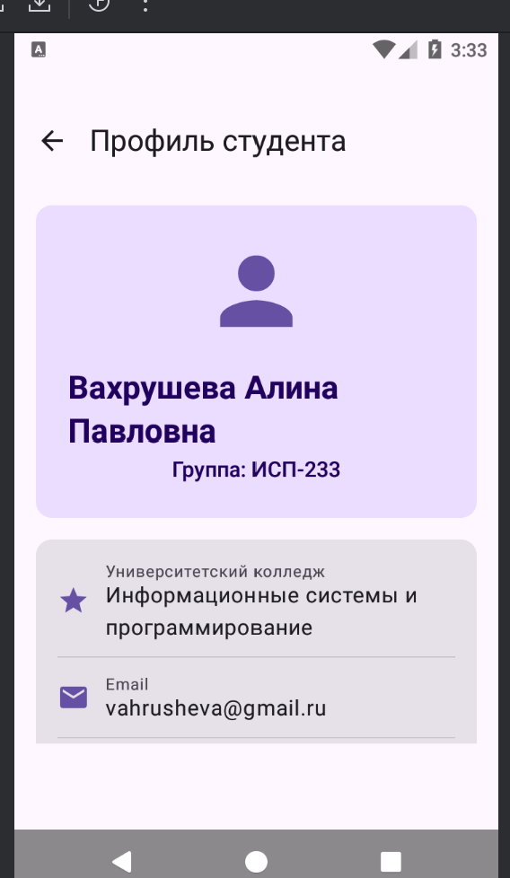

# Лабораторная работа №15-16. Navigation in Jetpack Compose

Приложение, которое помогает вести студенту свою школьную жизнь. В нем есть список всех дисциплин,
текущую оценку и просмотр расписания.

## список экранов

- Домашний экран
- Настройки
- Профиль
- о предмете

## Технологии
- Kotlin
- Jetpack Compose
- Navigation Compose
- NavHost 

## Схема навигации

1. Home - Details - Back
2. Home - Profile - Back
3. Home - Subject - Back

## Контрольные вопросы

1) NavController это технология, которая управляет навигацией между экранами. Из-за него можно переходить на другие экраны и возвращаться назад.
   Его создают через remembernavcontroller, чтобы он сохранялся и не пересоздавался
2) Сначала в маршруте пишут параметр '''details/{id}''' а потом делают туда переход. Параметры достают с backstackentry.arguments. Обязательные параметры нужно всегда передавать иначе будет ошибка. Опциональные можно не передавать тк есть значения ао умолчанию
3) Он используется чтобы хранить маршруты. Из-за этого код становится понятнее, меньше ошибок в написании маршрутов и возможность масштабироваться. 
4) Back stack это список экранов которые использовались. Home - Profile - settings. Если на экране настроек вызвать popBackStack то экрна закроется и приложение вернется на 1 назад
5) startDestination - это экран который первый при запуске. Первый при запуске например home. Иногда можно менять в процессе работы
6) Если перейти на несущ маршрут то контроллер не миожет его найти и выдастся либо ошибка или вылет приложения. Для предотвращения этого используют sealed class
7) launchSingleTop нужен для того чтобы одиин и тот же экран не добавлялся много раз в список экранов. Например если юзер нажмет 10 раз на один экран то он будет добавляться снова. launchSingleTop если экран уже сверху списка то он просто не добавится еще раз
